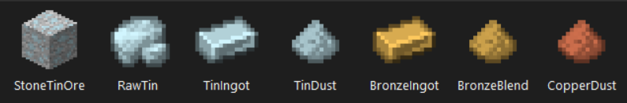

# MC-Texture-Tool

## Purpose

MC-Texture-Tool extracts the relevant textures from the game jar directly and stagers them into folders of the same name. Also provides an option to grayscale the textures for easy vanilla-style texture creation.

## Use Cases

For use in Minecraft mod devepment. More specifically - for use within MCreator.

## Features

- Automatic texture extraction
- Specify install directory and game version
- Grayscale textures

## Useage

**Note:**

Due to the use of preview features the java flag ```--enable-preview``` is required by java to run the application.
This will not be required in the future when the features are no longer in preview.

### From Compiled Source

```txt
java --enable-preview App 
```

### From Executable Jar

```txt
java --enable-preview -jar mc-texture-tool.jar  
```

### Supported Flags

```txt
java --enable-preview -jar -g           // grayscale output
                           -i <Path>    // Specify input folder (the location of the .minecraft folder)
                           -o <Path>    // Specify output folder (i.e. C:/textures/)
                           -v <A.B.C>   // Specify game version  (i.e. 1.20.6)

// A valid example (assuming the .minecraft folder is located in  C:/)
// java --enable preview App -g -i "C:/" -o "C:/textures/"
```

### Expected Output

An execution with the ```-g``` flag present would provide the following output...

```text
***************************************************
*             Minecraft Texture Tool
*         Author: github.com/crt.soluble
***************************************************
*
* [>] Setting user flags
*        [+] Grayscale output flag set: true
*
* [>] Executing with settings:
*        [+] Input Path: C:\Users\Corde\AppData\Roaming\.minecraft
*        [+] Output Path: C:\Users\Corde\OneDrive\projects\New folder\mc-texture-tool
*        [+] Grayscale Output: true
*        [+] Minecraft Version: 1.20.6
*
* [>] Initializing jar extractor
*        [+] Jar file found for version 1.20.6: 
*        [>] C:\Users\Corde\AppData\Roaming\.minecraft\versions\1.20.6\1.20.6.jar
*        [+] Jar file loaded into memory
*        [+] Extraction started
*        [+] Extraction output sent to: 
*        [>] C:\Users\Corde\OneDrive\projects\New folder\mc-texture-tool\original
*
* [>] Grayscaling the extracted textures
*        [+] Grayscaling completed processing 602 files: 
*        [>] C:\Users\Corde\OneDrive\projects\New folder\mc-texture-tool\grayscale\item
*        [+] Grayscaling completed processing 1061 files: 
*        [>] C:\Users\Corde\OneDrive\projects\New folder\mc-texture-tool\grayscale\block
*
*
* [>] Press any key to exit...
```

## Using With MCreator

MCreator allows you to import and colorizing texture templates to create custom item and block textures. To easily create custom vanilla style textures using the original textures as a base copy the contents of the directories:

```text
grayscale/item
grayscale/block

and (optionally to use the pre-colored tool handles etc...)

original/item
original/block
```

Open, or reopen MCreator to get access to the new texture templates.

## MCreator Custom Texture Examples

Below are some vanilla style item textures created by colorizing the grayscaled vanilla textures.




## Planned Features

- Armor extraction & grayscaling
- Automatic install of textures to mcreator templates folder
- In app ```-?``` (help) flag
- Graphical UI package
